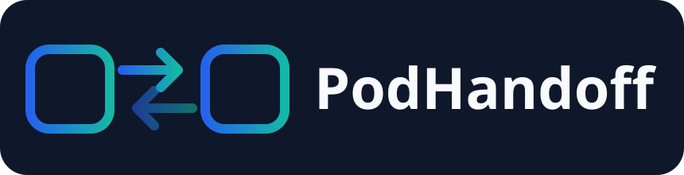

<div align="center">
  
  <p><b>Readiness-gated Pod handoff for announced Kubernetes disruptions.</b><br>
  Keep one application replica normally, add temporary capacity during a drain,<br>
  and release eviction only after the replacement is ready.</p>
  
</div>

Best effort, spelled out: no downtime from disruptions that announce
themselves, bounded downtime when a hard deadline cannot be won, and no
protection against unannounced hardware death. That last one is what a second
replica is for, and nothing changes it.

PodHandoff protects a single-replica Deployment when a node announces that it
is going away. It brings up a temporary stand-in, waits until that Pod is
genuinely serving traffic, and only then lets the original leave. The extra Pod
exists only while the disruption is in flight.

PodHandoff is derived from [Understudy](UPSTREAM.md). The imported baseline,
local changes, and attribution are recorded explicitly there.

The product boundary, safety principles, and pilot narrative are in
[Project direction](docs/project-direction.md).

```yaml
apiVersion: apps.podhandoff.io/v1alpha1
kind: PodHandoff
metadata:
  name: tenant-worker
spec:
  targetRef:
    kind: Deployment
    name: tenant-worker
  holdMode: always
  minSurgeTimeSeconds: 60
  readinessDeadlineSeconds: 600
```

## Why not just run two replicas

Two replicas is rent paid every hour of every day against an event that lasts
minutes a month. It also halves your capacity headroom during every drain, and
for workloads that are singletons by nature (leader-elected controllers,
schedulers, queue consumers with sticky assignment) the second replica is idle
spend that buys nothing.

PodHandoff's bet is narrower: your workload can tolerate two pods for a few
minutes. That is the same property a rolling update with `maxSurge: 1` already
requires, so if you deploy without downtime today, you qualify. The second pod
then exists only while a disruption is happening.

## What it survives

| Kind of disruption | Examples | Time available |
|---|---|---|
| Voluntary | node drain, Karpenter drift and consolidation and expiry, node pool upgrades, manual `kubectl drain` | unbounded, the eviction is held |
| Involuntary | spot and preemptible reclaim, host maintenance | fixed deadline, seconds to minutes |
| Deploys | rolling update of the workload itself | not our business, PodHandoff stands down |

## Upstream results

The upstream Understudy project reported the following measurements on EKS
with Karpenter and arm64 spot nodes. They are provenance for the imported
design, not PodHandoff release evidence. PodHandoff must reproduce the relevant
drain tests in its own CI and stage pilot before making an availability claim.

| Event | Failed requests |
|---|---|
| Nothing happening (control) | 0 of 120 |
| `kubectl drain` | 1 of 350 |
| Karpenter disruption | 1 of 189 |
| Real AWS spot interruption | 1 of 764 |
| Ordinary rolling update, no PodHandoff involved (control) | 2 of 38 |

The last row is the important one. The handful of requests lost during a
disruption are lost as the old pod exits, and an ordinary deploy of the same
workload loses more. PodHandoff makes a node disruption cost about what a
routine deploy costs.

## Requirements

PodHandoff enforces at admission, so the API server has to be able to reach
the webhook service on port 443. That is the default nearly everywhere and
the admission API it uses has been stable since Kubernetes 1.16, but it is
not universal: a private control plane with tightly scoped security groups,
or a network policy that does not admit control-plane traffic, will block
the path. The chart declares Kubernetes 1.34 or newer.

The webhook is registered `failurePolicy: Ignore` deliberately, because a
webhook that cannot be reached must never wedge every eviction in the
cluster. The consequence is worth stating plainly: an unreachable webhook
degrades to no protection rather than to an error, quietly. Check it once
after installing, by evicting a protected pod and expecting a refusal:

```sh
kubectl create --raw "/api/v1/namespaces/NS/pods/POD/eviction" -f - <<'EOF'
{"apiVersion": "policy/v1", "kind": "Eviction",
 "metadata": {"name": "POD", "namespace": "NS"}}
EOF
```

A working install answers `TooManyRequests` and starts a surge. Silence
means the API server never reached the webhook.

## Install

```sh
helm install podhandoff oci://ghcr.io/cozyGarage/charts/podhandoff \
  --namespace podhandoff-system --create-namespace
```

Or from a checkout:

```sh
helm install podhandoff ./charts/podhandoff \
  --namespace podhandoff-system --create-namespace
```

Upgrading from an earlier version? See [UPGRADING.md](UPGRADING.md).

Then protect a workload by creating an `PodHandoff` next to it. `kubectl get
podhandoffs` shows the target, the mode, the phase, and how long anything has
been blocked.

The footprint of the default install is one Deployment with one replica. The
webhook is served from that same pod. There is no DaemonSet and no per-node
agent. Drains, Karpenter disruption, autoscaler scale-downs and node upgrades
are all detected from the API server by the operator pod alone, and on
Karpenter clusters that includes spot interruptions, because Karpenter reacts
to the interruption queue by tainting the node and the operator sees the
taint.

On clusters where every node carries a taint, the operator needs a matching
toleration and node selector, the same as any other controller you run there.

### Cloud sentinels (optional, off by default)

Everything above works without this section. Skipping it is a reasonable
choice, and if you do, the one thing to remember is to set
`readinessDeadlineSeconds` below your platform's spot notice window, so the
operator never holds an eviction against a deadline it cannot see.

What the sentinel adds is the deadline itself. Without it, a spot interruption
reaches the operator as an ordinary drainer taint, indistinguishable from an
unbounded drain. The sentinel reads the cloud's termination notice on the
node and passes along how long is actually left, which is what lets the
operator choose between holding the eviction and releasing it immediately. It
also shaves about 15 seconds off the reaction time compared to the queue path.

It is a DaemonSet only because every cloud serves termination notices on a
link-local metadata endpoint that nothing outside the instance can read.
Scope it to the node pools that can actually be preempted; it has no business
running anywhere else.

```sh
helm upgrade podhandoff ./charts/podhandoff \
  --set sentinel.enabled=true \
  --set sentinel.cloud=aws \
  --set 'sentinel.nodeSelector.karpenter\.sh/nodepool=spot'
```

The AWS probe has been validated against real spot interruptions. The GCP and
Azure probes are covered by unit tests only. Treat them as experimental until
someone runs them on GKE and AKS.

## Configuration

If Argo CD manages a protected Deployment, configure the two temporary fields
before enabling protection. See [GitOps coexistence](docs/gitops.md).

| Field | Default | What it does |
|---|---|---|
| `targetRef.name` | required | The Deployment to protect, in the same namespace |
| `surgeReplicas` | 1 | How many stand-ins to add |
| `minSurgeTimeSeconds` | 60 | How long this workload realistically takes to start serving. If a termination deadline is nearer than this, the eviction is released immediately instead of being held |
| `readinessDeadlineSeconds` | 600 | How long to hold an eviction with no progress before giving up and letting it through |
| `holdMode` | `always` | Which disruptions are worth making wait. See below |

`holdMode` decides whether an eviction is held at all. The surge is not
affected by it: a stand-in comes up on every doom signal in all three modes,
because bringing one up early costs nothing and losing the race costs
everything.

- `always` holds both kinds. A drain, a consolidation or an upgrade waits
  as long as it takes, and a spot reclaim waits too, until the deadline
  gets close enough that `minSurgeTimeSeconds` says the race is lost.
- `voluntary-only` holds a disruption that can wait and never one that
  cannot. The node in a spot reclaim is going away at a fixed moment
  whatever any budget or webhook says, so the eviction is admitted at once
  and the pod spends its last seconds shutting down cleanly instead of
  being refused and then killed. Use it when your workload drains
  connections on `SIGTERM` and you would rather it start immediately.
- `off` never holds. The stand-in is still brought up in parallel, so the
  workload is down only for as long as the replacement takes rather than
  for as long as a reschedule takes. Use it where bin-packing matters more
  than the last second of uptime, or to disable the hold for one workload
  without touching the rest of the cluster.

If you run on spot without the sentinel, set `readinessDeadlineSeconds` below
the platform's notice window, otherwise the operator can hold an eviction
against a deadline it cannot see.

## How it works

Briefly: answer the eviction at the door with HTTP 429, surge when its node is
reported doomed, admit a retry once the replacement passes its readiness
gates, and scale back by removing the right pod. No PodDisruptionBudget is
created. The full explanation, with diagrams and the reasoning behind each
decision, is in
[docs/how-it-works.md](docs/how-it-works.md).

Signals reach the operator through four adapters, and the core contains no
provider-specific code:

| Adapter | Sees |
|---|---|
| Cordon watch | `kubectl drain`, GKE and AKS and EKS upgrades, cluster-autoscaler, kured |
| Taint watch | Karpenter, cluster-autoscaler, plus any key you configure |
| Eviction webhook | every eviction attempt from every drainer, including ones nothing else detects |
| Cloud sentinel (optional, off by default) | spot and preemptible notices, with their deadlines |

## Safety

Alert on `podhandoff_oldest_blocked_eviction_seconds`. It exists so that a held
eviction is always visible and bounded.

If a surge cannot make progress, the hold is relaxed rather than stalling the
drain forever. The webhook is fail-open: if every operator replica is
unavailable, Kubernetes admits evictions normally within the webhook timeout.
To disable holds immediately:

```sh
kubectl delete validatingwebhookconfiguration podhandoff-eviction-hold
```

The operator refuses to manage itself, skips targets it cannot help, and stands
down while a rollout is in progress.

For production, use `replicaCount: 2` and place the replicas on different
nodes. The webhook serves from every replica even though reconciliation is
leader-gated. If the node hosting the only operator pod is drained, its own
eviction is admitted and protection for pods later in that drain can disappear.

## Limits

PodHandoff reacts to disruptions; it never starts one. Because there is no
budget for a disrupter to pre-check, consolidation, drift and expiry can select
the node normally. The disrupter begins, retries the admission hold while the
stand-in starts, and proceeds as soon as the stand-in is ready.

**In-flight requests are not saved.** PodHandoff guarantees a ready
replacement, not the requests already travelling to the departing pod. Give
the pod a `preStop` hook that outlasts your load balancer's deregistration
delay; no surge mechanism can do it for you.

**An involuntary deadline is a race against the platform.** AWS gives about
two minutes, which a fast-booting workload can win even when a new node has
to be provisioned first. GCP and Azure give about thirty seconds, which
cannot be won cold, so there the value is an orderly release and an early
replacement rather than zero downtime.

**Workloads that cannot run two instances at once are out of scope**,
including single-replica StatefulSets, and always will be.

## Development

```sh
make test    # envtest suite, downloads Kubernetes binaries on first run
make lint
make build
```

## License

Apache 2.0

PodHandoff retains Apache-2.0 licensing and its upstream provenance. Run
`make license-check` to verify that baseline and report dependency-license
gaps; run `make sbom` to generate a CycloneDX dependency inventory.
