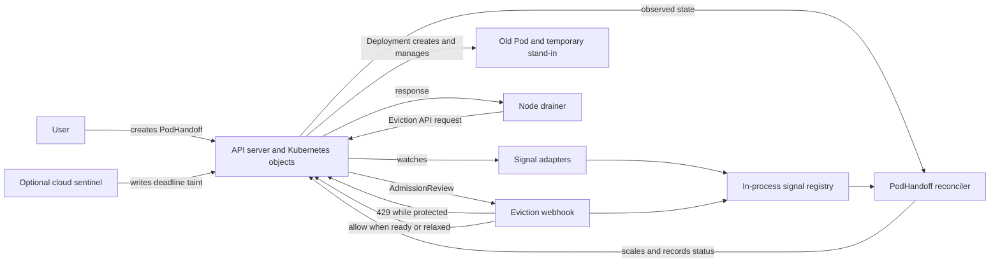

# Architecture and Kubernetes concepts

PodHandoff is structured like a small operator: it adds an API resource,
observes Kubernetes state, reconciles a target Deployment, and uses an
admission webhook to make a synchronous decision on eviction requests. The
goal here is to make those patterns concrete and inspectable.

## Component map

The controller and webhook are registered by [`cmd/main.go`](../cmd/main.go)
with controller-runtime's manager. Signal adapters normalize different node
observations into a provider-neutral `NodeDoom` value. The controller decides
what Deployment state should exist; the webhook answers each eviction request
using the current protection state. See [How it works](how-it-works.md) for
the detailed event sequence.

| Component | Code | Responsibility |
|---|---|---|
| API | `api/v1alpha1` | `PodHandoff` spec, status, and schema markers |
| Manager setup | `cmd/main.go` | Kubernetes scheme, controllers, webhook server, health and metrics endpoints |
| Signal adapters | `internal/signal` | Observe cordons, taints, eviction attempts, and optional deadlines |
| Reconciler | `internal/controller` | Assess target Pods, start a surge, track progress, release, and restore baseline |
| Ownership checks | `internal/ownership` | Follow Pod → ReplicaSet → Deployment ownership |
| Manifests | `config` | CRD, RBAC, webhook configuration, manager deployment |
| Tests | `internal/**`, `test/e2e` | Unit/envtest behavior and a Kind-based cluster scenario |

## Kubernetes ideas demonstrated

### Custom resources and controllers

`PodHandoff` is a custom resource that declares which Deployment to watch and
how the handoff should behave. Its `spec` is the user's intent; its `status`
reports the observed phase and conditions. The controller repeatedly reads
the resource and related Kubernetes objects, then makes small changes until
observed state matches the desired handoff state.

This is reconciliation: events prompt a reconcile, but the reconcile should
be safe to run again. It must account for partially completed work, API
errors, and restarts instead of assuming one event arrives exactly once.

Schema comments in `api/v1alpha1/podhandoff_types.go` are inputs to
`controller-gen`. `make manifests` produces the CRD and related manifests;
`make generate` produces generated Go methods such as deep-copy code. Generated
files are committed so the API schema and code stay reviewable.

### Watches and signal adapters

Kubernetes controllers commonly watch resources and enqueue reconciliation
when relevant state changes. PodHandoff also adapts several disruption
indicators—such as a cordoned node, a recognized taint, or an eviction
attempt—into one internal signal type. This keeps provider-specific detection
separate from the Deployment handoff logic.

The signal is not a prediction that a failure will happen. It is evidence of
an announced or already-started disruption. If the node disappears without a
usable signal, this mechanism cannot protect the workload.

### Admission webhooks and eviction

The Kubernetes Eviction API lets a drainer ask the API server to evict a Pod.
The validating webhook can reject that request temporarily. A rejection with
HTTP 429 (`TooManyRequests`) tells compatible drainers to retry later. Once a
ready replacement exists—or the configured hold is relaxed—the webhook allows
the retry.

This is a synchronous API-server path, distinct from the controller's
eventual reconciliation loop. The webhook uses `failurePolicy: Ignore` so an
unavailable PodHandoff does not block cluster maintenance. The tradeoff is
that protection disappears while the webhook is unreachable.

### Readiness and availability

`Running` only says the container process has started. `Ready` is Kubernetes'
signal that a Pod can receive Service traffic; configured readiness gates can
include additional integration such as load-balancer registration. PodHandoff
uses readiness when deciding whether to release an eviction.

Readiness does not prove application correctness, safe duplicate processing,
or preservation of requests already in flight. Those properties belong to
the workload and its shutdown behavior.

### Finalizers, ownership, and cleanup

The controller temporarily changes the target Deployment's replica count and
uses Pod deletion cost to make the doomed Pod the preferred scale-down target.
It records the original count so it can restore the baseline after the
handoff. A finalizer gives it a chance to clean up owned changes when a
`PodHandoff` resource is deleted.

The ownership helper follows Kubernetes owner references instead of trusting
matching labels alone. This is a useful controller pattern: labels select
candidates, while owner references establish which controller owns them.
The [GitOps example](gitops.md) shows a related field-ownership conflict; it is
explicitly unverified against a live reconciler.

### Bounded waiting and fail-open behavior

Holding an eviction forever would trade a service interruption for a stuck
node drain. PodHandoff therefore bounds the hold with a readiness deadline
and may release it when an external termination deadline leaves too little
time to start a replacement. The webhook also fails open when the service is
unavailable.

These behaviors illustrate a common distributed-systems tradeoff: protection
can be best-effort and bounded, or it can block progress. PodHandoff chooses
bounded protection so it does not become a cluster-wide maintenance hazard.

## What this architecture does not teach by itself

The demo does not make a workload highly available, infer safe replica counts,
or predict crashes from logs. It does not replace Deployments, probes, Pod
Disruption Budgets, topology spread, autoscaling, or application-level
graceful shutdown. Those Kubernetes and application mechanisms remain the
right starting point for production availability.
