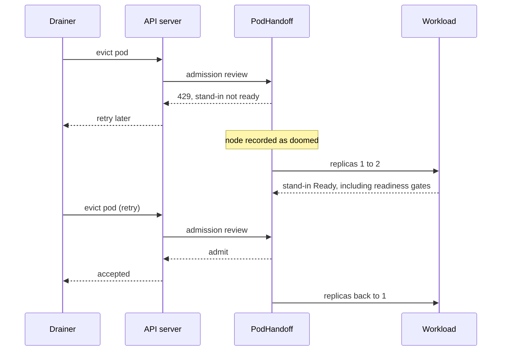
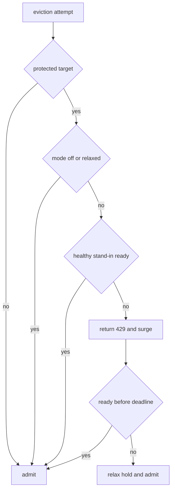

# Handoff flow

This walkthrough follows one eviction through the educational controller
example. The [architecture guide](architecture.md) explains the component
boundaries and Kubernetes concepts; the [build guide](building.md) maps them
to the source tree.

## The mechanism

Five steps happen in order.

**1. Answer the eviction at the door.** The always-on validating webhook
handles `pods/eviction` CREATE. For a protected pod with no ready stand-in it
returns HTTP 429 and `TooManyRequests`. Drainers already retry that response.
No PodDisruptionBudget is created, so Karpenter and cluster-autoscaler can
select a node without being blocked by a budget pre-check.

**2. Record the node as doomed.** Cordon, taint, eviction and optional cloud
sentinel adapters normalize their observations into a `NodeDoom`.

**3. Surge.** The controller increases the Deployment replica count and marks
the old pod with a negative `controller.kubernetes.io/pod-deletion-cost`.

**4. Wait for traffic readiness.** A stand-in counts only when it is Ready, is
not deleting, and runs on neither the victim node nor another doomed node.
Readiness gates therefore include load balancer registration. Once enough
healthy stand-ins exist, the webhook admits the drainer's next retry.

**5. Scale back.** After the old pod leaves, the Deployment returns to its
original replica count. The deletion cost makes the old pod the preferred
scale-down target.



## Signals

The core consumes one provider-neutral value:

```go
NodeDoom{
    Node      string
    Class     VoluntaryUnbounded | Involuntary
    Deadline  *time.Time
    ExpiresAt *time.Time
    Source    string
}
```

| Adapter | Signal |
|---|---|
| Cordon watch | `spec.unschedulable`, including `kubectl drain` and many managed upgrades |
| Taint watch | Karpenter, cluster-autoscaler and configured drainer taints |
| Eviction webhook | Every matching eviction attempt, including eviction-only drainers |
| Cloud sentinel | Optional cloud termination notice with its deadline |

The webhook is both a signal source and the enforcement point. Dry-run
requests, deleting pods, unsupported targets and unprotected pods are admitted.
If multiple PodHandoff resources match a pod, every one must be ready or
relaxed before the eviction is admitted.

## Hold and release decisions

Voluntary disruption is held until the stand-in is ready. An involuntary
deadline is compared with `minSurgeTimeSeconds`; if too little time remains,
the hold is relaxed immediately while the surge continues. A hold is also
relaxed after `readinessDeadlineSeconds`, ensuring an unschedulable stand-in
cannot wedge a drain forever.

`holdMode` chooses which of those disruptions are held in the first
place. `always` holds both classes, `voluntary-only` holds the unbounded
ones and admits anything carrying a deadline the moment it is seen, and
`off` admits everything. The mode gates the hold alone: the surge runs in
every mode, since a stand-in started early costs a pod for a few minutes
and a stand-in started late costs the outage it was meant to prevent.

The field was called `hostageMode` when a budget took the eviction
hostage. That spelling is deprecated but still honored: a resource setting
only the old field keeps working, and the operator raises one warning event.



## Phases

| Phase | Meaning |
|---|---|
| `Idle` | No disruption is active; matching evictions are protected |
| `Surging` | A doomed node was seen and the stand-in is not ready |
| `Releasing` | A healthy stand-in is ready and eviction retries are admitted |
| `Relaxed` | The hold was released without a ready stand-in |
| `Unsupported` | The target cannot be protected and is never held |

## Failure behaviour

The webhook uses `failurePolicy: Ignore`. If all operator replicas are
unavailable, requests fail open after `webhook.timeoutSeconds` and Kubernetes
returns to its normal eviction behavior. Deleting the
`<release>-podhandoff-eviction-hold` ValidatingWebhookConfiguration disables
holds immediately.

An operator restart therefore creates a protection gap rather than a stuck
cluster. This is the fail-open tradeoff: cluster operations keep moving while
the handoff protection is unavailable. Reconciliation uses leader election,
but every operator replica serves webhook traffic.

The code retains a leader-gated startup sweep for legacy PodDisruptionBudgets
labeled `podhandoff.io/owned=true`. The associated PDB permissions exist for
migration cleanup; this is a useful example of compatibility code that can
remain after the main design changes.

## Metrics

- `podhandoff_oldest_blocked_eviction_seconds`: age of the oldest active hold
- `podhandoff_evictions_held_total`: admission requests answered with 429
- `podhandoff_eviction_attempts_observed_total`: attempts split by protection
- `podhandoff_surges_total`: surges by signal class
- `podhandoff_hold_relaxed_total`: holds relaxed by reason

## Limits

When a hold is successfully released, the replacement has passed Kubernetes
readiness checks; deadline relaxation and webhook failure can still let an
eviction proceed without that replacement. This does not preserve requests
already in flight. A workload needs its own graceful-shutdown and traffic
deregistration behavior.

Cold capacity still takes time. Voluntary disruptions can wait; involuntary
ones race the platform deadline. Workloads that cannot briefly run two
instances, including single-replica StatefulSets, are out of scope.
